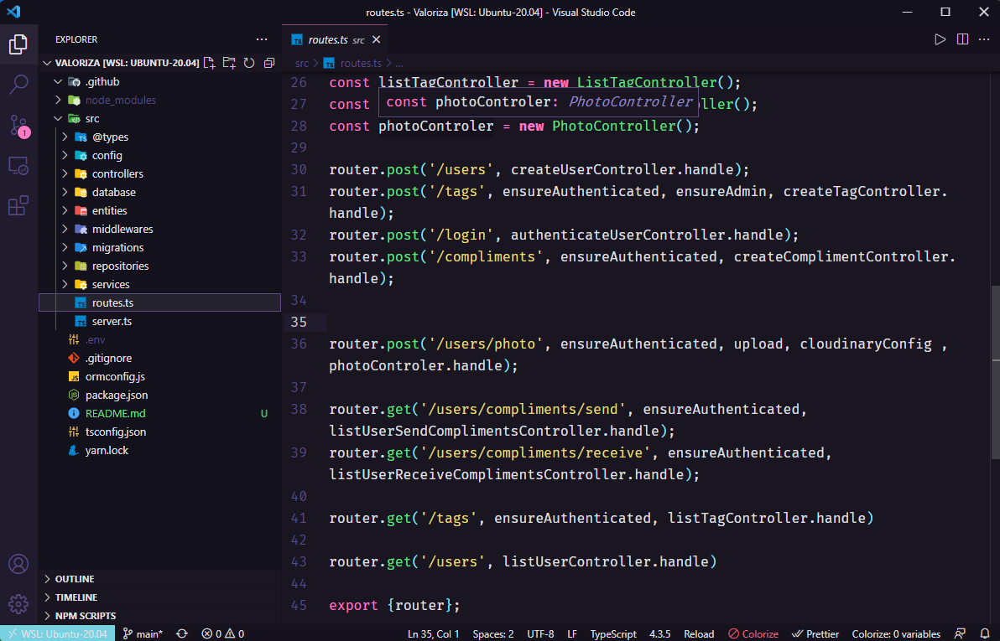

<h1 align="center">Valoriza</h1>

  

  

  

## ✨ Tecnologias

Esse projeto foi desenvolvido com as seguintes tecnologias:

- [Node.js](https://nodejs.org/en/)
- [Typescript](https://www.typescriptlang.org/)
- [Express](https://expressjs.com/pt-br/)
- [JSONWebToken](https://github.com/auth0/node-jsonwebtoken#readme)

## 💻 Projeto

Valoriza é uma plataforma para promover o reconhecimento entre companheiros de equipe.

## 🚀 Como executar

- Clone o repositório
- Rode `yarn` para baixar as dependências
- Precisa alterar os caminhos para as migrations e entities no ormconfig.json
- Rode `yarn typeorm migration:run` para criar as tabelas do banco de dados.
- Rode o `yarn dev` para iniciar a aplicação.

Por fim, a aplicação estará disponível em `http://localhost:3000`

## Extras

Diferente do projeto original, esse foi criado usando PostgreSQL

Adicionei a possibilidade do usuário adicionar foto no cadastro.

Usei o Multer com o cloudinary, assim a imagem é enviada automaticamente para Cloudinary, e criei uma tabela de Photos, que guarda o link e a referencia para o usuário.

O projeto está configurado para deploy no Heroku.